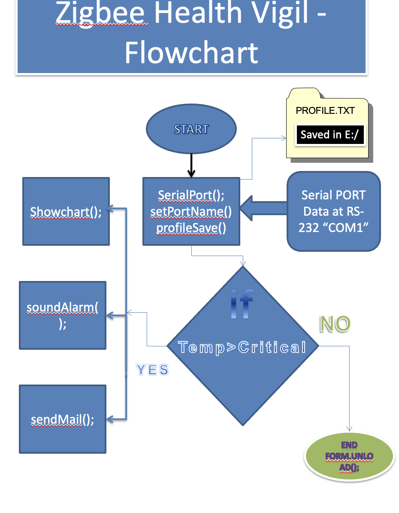
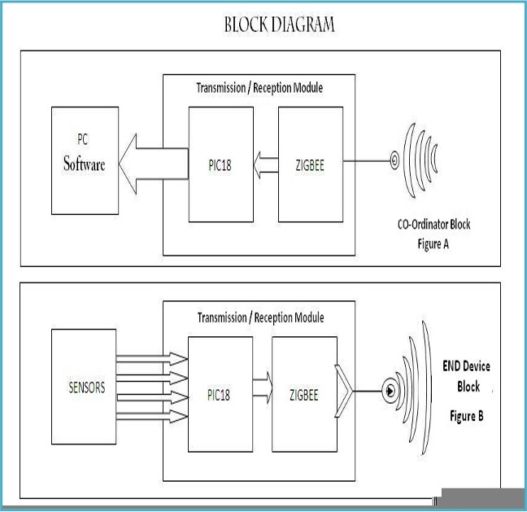
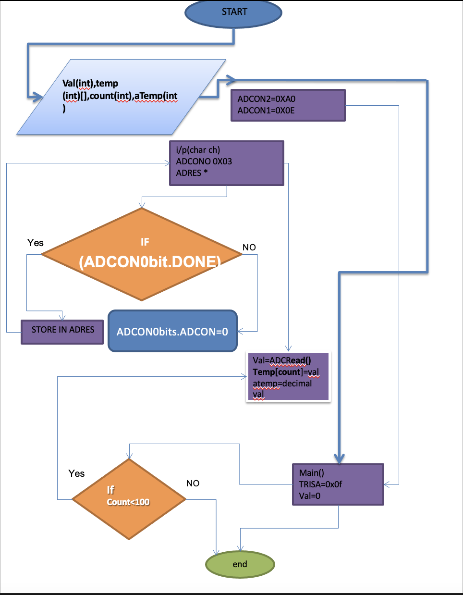
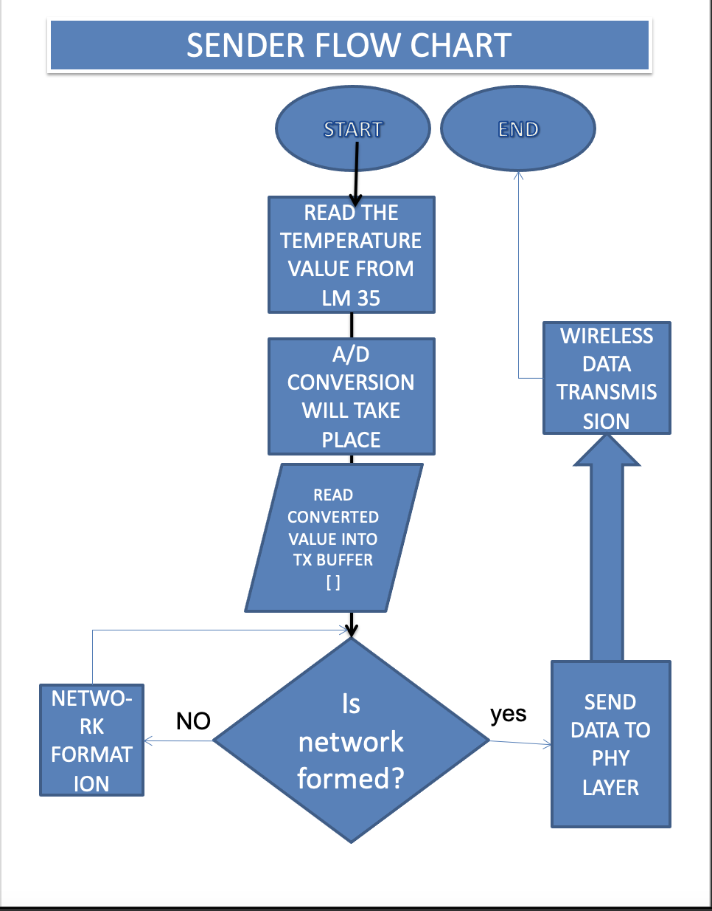
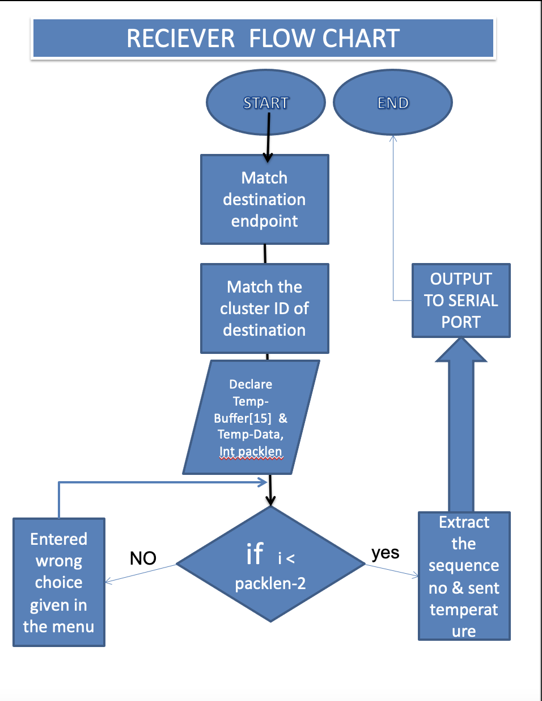

# infant-health-monitoring
The source code to the project I made for my senior year project; also a runner up entry at the Microsoft Imagine Cup.

## Overview
I made this project with my friends at University. I was trying to create a proof-of-concept where a baby's health could be monitored using a wearable device. The device would be able to detect the baby's heart rate, breathing rate, and temperature. The device would also be able to detect if the baby was crying or not. The device would then send this data to an application where the parents could see the data and be alerted if something was wrong. 

This was before smartphones were as ubiquitous as they are now, so I decided to use a Windows .NET framework as the application platform. That and the fact that my professor was pretty specific about wanting to see how it all worked.

The device would send the data to a server, which would then send the data to the application. The application would then display the data and alert the parents if something was wrong.

- The ZigBee Unit (that also housed the microcontroller) was graciously lent/provided by Larsen & Toubro.
- The Transistor chosen to detect temperature was the LM35.

## Flows
>These screenshots are old and janky. Please excuse them.
### Zigbee Flow

### System Flow

### Microontroller Flow

### Sender Flow

### Receiver Flow

# Final Thoughts
This is a project that I am very proud of. I learned a lot about how to work with a team, how to manage a project, and how to work with hardware. I also learned a lot about how to work with the .NET framework. I am very happy with how it turned out.

I am skeptical about this working on your systems, so consider this repository as an archive of my work. I am not actively maintaining this repository, so if you have any questions, feel free to contact me.
